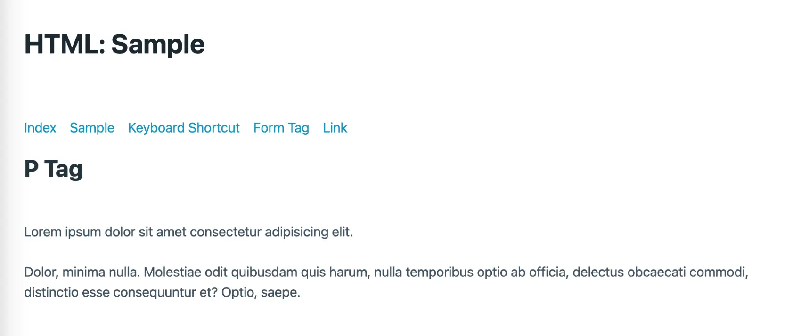

# Practice HTML Starter

The HTML starter was created to students practice HTML and learn about the different types of HTML tags, including semantic, form tags, and general use. It also includes MAC OS keyboard shortcuts.

 

## Website
* 👉 [jsohndata.github.io/practice-html-starter](https://jsohndata.github.io/practice-html-starter/)

 

## CSS FrameWork
* [picocss.com](https://picocss.com/docs)